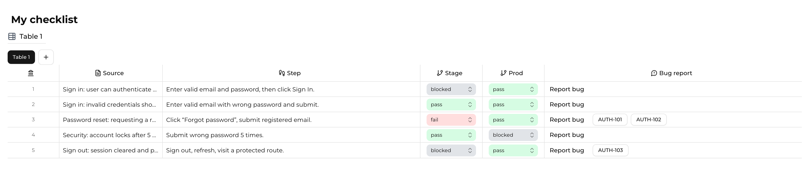
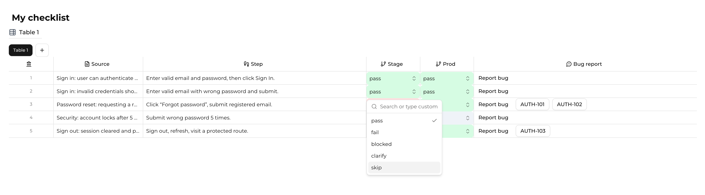
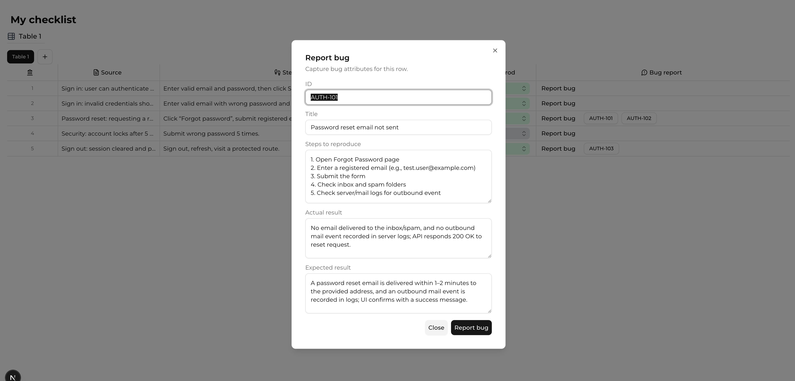

Checklist is a Next.js app for creating interactive QA/dev checklists with per‑table state persisted locally.

## Overview

A lightweight checklist creation tool tailored for QA and development flows. It lets you log checks row‑by‑row, track status across environments, and attach structured bug reports per failing check. Optimized for speed, local persistence, and an efficient keyboard‑driven workflow.

## How It Works

- Each row represents a single check:
  - `Source`: paste the relevant slice of requirements you are testing against.
  - `Step`: describe the exact action or verification performed.
  - `Status` columns: log outcomes per environment; includes built‑ins (pass/fail/blocked/clarify/skip) and accepts custom statuses. In this project, defaults are `Stage` and `Prod`.
  - `Bug report`: open a dialog to record structured details (ID/title/steps/actual/expected) for issues found during that check. Multiple reports per row are supported.

Visual examples







## Features

- Multi-table checklists with per-table local persistence
- Editable checklist and table names with inline UX
- Row-based inputs: free text and status combobox with custom entries
- Bug report dialog per row (multiple reports supported)
- Keyboard-friendly: Enter on last "Step" auto-adds next row
- Responsive, resizable columns with shadcn UI primitives

## Getting Started

First, run the development server:

```bash
npm run dev
# or
yarn dev
# or
pnpm dev
# or
bun dev
```

Open [http://localhost:3000](http://localhost:3000) with your browser to see the result.

Key implementation notes

- State: Uses Zustand with `persist` to localStorage. Store is versioned (`version: 3`) with a `migrate` hook for schema evolution.
- Hydration: Client components use a shared `useIsClient` hook to avoid SSR/CSR mismatches while rehydrating persisted state.
- Keys: Cell IDs are generated via `cellKey(column, rowId)` to ensure stable, predictable keys regardless of column label spacing.
- UI: Reusable components live under `src/components`; shadcn UI primitives are under `src/components/ui`.

This project uses [`next/font`](https://nextjs.org/docs/app/building-your-application/optimizing/fonts) to automatically load the Google font Montserrat.

## Development

Run the dev server:

```
npm run dev
# or: yarn dev / pnpm dev / bun dev
```

Open http://localhost:3000 to view the app.

## Tech Stack

- Next.js 15 (App Router), React 19
- TypeScript, ESLint (flat config)
- Zustand (with `persist`) for state management
- Tailwind CSS v4 + shadcn UI components (Radix primitives)
- Yarn 4 (via Corepack)

## Scripts

- `yarn dev` — start development server
- `yarn build` — production build
- `yarn start` — run production server
- `yarn lint` — run ESLint
- `yarn typecheck` — TypeScript type checking
 
## License

MIT — see `LICENSE` for details.

 
